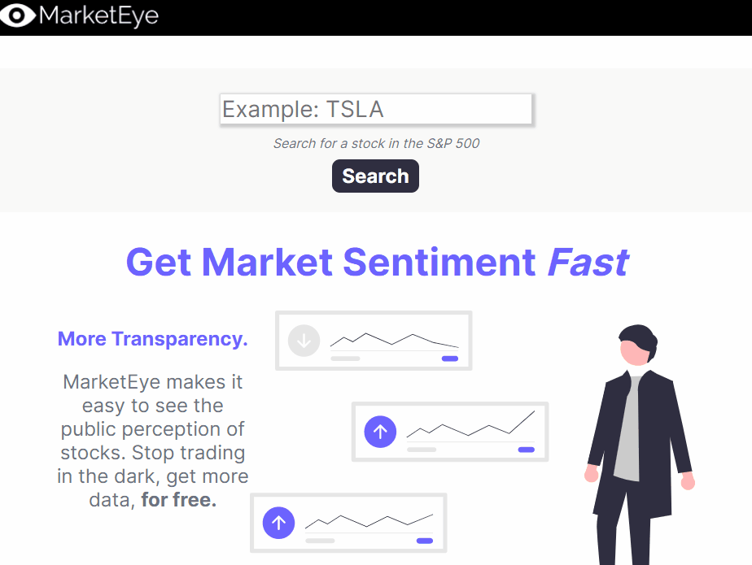

# MarketEye 📈
See stock sentiment for **all** stocks in the S&P 500. Uses NLP machine learning on web scraped Tweets.

**Link: http://marketeye.us**

**YouTube Video Showcase:  https://youtu.be/12SLd-mnxBs**
## How It Works: 🚀
- ```tasks.py``` cycles through all of the stocks in the S&P 500 (```spy_list.csv```)
- Each stock has recent and top tweets webscraped from Twitter in ```webscraper.py```
- Each Tweet is cleaned and then run into `SentimentClass` within ```machine_learning.py```
- The NLP (natural language processing) algorithm classifies every Tweet as positive or negative
- All of this data is written to ~1000 CSV files, 
- When a user searches up a specific stock, the data is retrieved from the accompanying CSV files!


## GIF: 🖥️



